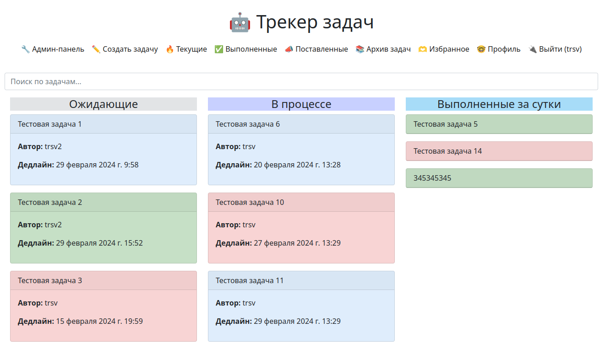

# Simple task tracker

### Трекер задач с простым функционалом




## Описание

Это пэт-проект, главной целью которого является возможность 
попробовать в деле интересующие технологии, такие как Docker, Celery, Celery Beat, Redis.

Демо: https://tracker.trsv-dev.ru/ (trsv / 1234509876t)

Flower: https://tracker.trsv-dev.ru:5556 (admin / MySuperStrongPassword)

## Стек технологий:
* celery==5.3.4
* Django==4.2.5
* flower==2.0.1
* redis==5.0.3
* django-celery-beat==2.5.0
* pillow==10.2.0
* Markdown==3.5.1


## Возможности

<details>
<summary>Описание возможностей</summary>

- На главной странице проекта можно назначать задания пользователям;
- Задачи может создавать только зарегистрированный пользователь;
- О новом назначенном задании пользователи узнают из письма, которое приходит им на почту;
- Ответственный за задачу пользователь (и администратор) может переназначить задачу другому
пользователю, о чем ему будет сообщено в электронном письме;
- Редактировать задачу может автор задачи, администратор или ответственный пользователь;
- Можно менять дату и время дедлайна (ответственному пользователю придет сообщение о смене даты и времени дедлайна);
- Если не указывать дату дедлайна при создании задачи, то напоминание о дедлайне придет за сутки до дедлайна;
- Можно менять дату и время напоминания о дедлайне;
- В случае приближения дедлайна ответственный пользователь получает оповещение на электронную почту;
- Удалить задачу может автор задачи, администратор или ответственный пользователь;
- Есть возможность обсуждения задачи посредством комментариев под задачей;
- На комментарии можно отвечать (вложенные комментарии);
- Оставлять комментарии может только зарегистрированный пользователь;
- Редактировать комментарии автором;
- Удалить комментарий может только автор комментария;
- Комментарии можно редактировать или удалять в течение 30 минут после создания;
- В комментариях можно упоминать пользователя (пользователей) через '@', например, @username.
Упомянутому пользователю (пользователям) придет сообщение на электронную почту с информацией о том,
что их упомянули в комментариях к такой-то задаче;
- В комментариях и описании задачи есть возможность использовать базовое Markdown форматирование, 
например, вставку кода;
- На странице деталей задачи и в комментариях работает подсветка синтаксиса.
- Отправка оповещений по электронной почте происходит асинхронно, если интернет-соединение
было потеряно или сервер не ответил то будет совершено несколько попыток отправки с экспоненциальным
возрастанием времени между попытками;
- Поиск по названиям задач и описанию;
- Разбиение задач по категориям "текущие", "выполненные", "поставленные", "поставленные, 
но невыполненные". Общий архив задач;
- Сортировка поставленных вами, но невыполненных задач по времени создания и по дедлайну;
- Регистрация, авторизация, смена пароля, восстановление пароля;
- Визуальные метки на невыполненных и просроченных по дедлайну задачах;
- Добавление и удаление задач в избранное/из избранного;
- Прикрепление к задаче и комментариям сразу нескольких изображений;
- Ограничение на количество прикрепляемых к задаче и комментарию изображений (по умолчанию 5);
- Ограничение на глубину вложенных комментариев (по умолчанию глубина равна 3);
- Адаптивный внешний вид под десктоп и смартфон,
- Добавление тегов к задачам, возможность фильтрации задач по одинаковым тегам,
- Добавление лайков к комментариям,
- Возможность добавления задачи в избранное,
- Профили пользователей с возможностью редактирования информации о пользователе и смены аватара,
- Аватарки пользователей рядом с юзернеймом. Отображаются в обсуждениях под задачами,
- Нажатие на никнейм автора комментария редиректит на его профиль,
- Возможность менять "видимость" своего профиля для неавторизованных пользователей, используя опцию "Приватный профиль",
- Создание черновиков задач, изменение в которых не будет никак затрагивать других пользователей 
(например, отправку писем о назначении ответственного в черновике или письма об изменении времени наступления дедлайна, удалении и т.д.).
Черновики не отображаются ни в каких выборках задач, кроме раздела "Черновики" в профиле пользователя. 
Пользователи не могут просматривать черновики друг друга.
- В текст задачи и комментарии можно добавлять изображения через
``````
или
```<image src="https://picture.jpg">```. Изображение будет масштабироваться вместе с шаблоном и
отображаться со ссылкой на оригинал внизу.
- Возможность запретить просмотр задач трекера незарегистрированным 
пользователем и запретить регистрацию. Для этого нужно раскомментировать в settings.py
строку:
```
'task_tracker.middlewares.AuthMiddleware'
```
- Добавлен Telegram-бот для отправки уведомлений пользователям 
(пока в режиме тестирования работает только отправка уведомлений о дедлайнах).
Для того чтобы запустить бота, создайте своего бота через @BotFather и пропишите в .env полученный
токен.


- Управлять ботом можно командами:


  _Локально в среде разработки:_
```
python manage.py bot start
python manage.py bot stop
```
  _На продакшне:_
```
docker compose -f docker-compose.production.yml exec -d backend python manage.py bot start
docker compose -f docker-compose.production.yml exec -d backend python manage.py bot stop
```
  _В локальных контейнерах:_
```
docker compose -f docker-compose.yml exec -d backend python manage.py bot start
docker compose -f docker-compose.yml exec -d backend python manage.py bot stop
```
</details>

## Планы

- ~~Теги и система фильтрации по тегам,~~
- ~~Улучшение профиля пользователя (аватарка или картинка, списки задач),~~
- ~~Возможность загружать несколько изображений к задаче,~~
- ~~Аватарки пользователей у сообщений,~~
- ~~Приватные профили, отображаемые только авторизованным пользователям,~~
- ~~Черновики задач,~~
- ~~Бот для уведомлений,~~
- Оптимизация
- ...

## Запуск проекта
<details>
<summary>Запуск проекта в контейнерах Docker</summary>

Подразумевается, что Docker уже установлен.

Клонируйте репозиторий с **develop веткой** к себе на машину:

```
git clone git@github.com:trsv-dev/simple_task_tracker.git -b develop
```
В корне проекта найдите файл **.env.example**, переименуйте в **.env** и заполните своими данными.

На продакшне раскомментируйте эту строку и замените 'your_domain.com' на свой домен:
```
CSRF_TRUSTED_ORIGINS=your_domain.com
```
Также замените '127.0.0.1:9000' на свой домен в этой строке:
```
BASE_URL=http://127.0.0.1:9000
```
И выставите Debug в False:
```
DEBUG=False
```

Чтобы заработала почта - скопируйте и вставьте в
**.env** в раздел "Email settings" следующие данные (тестовый пустой ящик на Яндекс.Почте):
<details>
  <summary>Конфиг почты</summary>

```
#Email settings:
###############################################################################
RECIPIENT_ADDRESS='trsv.dev@yandex.ru'
EMAIL_HOST='smtp.yandex.ru'
EMAIL_PORT=465
EMAIL_USE_SSL=True
DEFAULT_FROM_EMAIL='trsv.dev@yandex.ru'
EMAIL_HOST_USER='trsv.dev@yandex.ru'
EMAIL_HOST_PASSWORD='hzitlzdryltagtly'
EMAIL_BACKEND='django.core.mail.backends.smtp.EmailBackend'
```
</details>

Так же обратите внимание на секцию **#Celery settings**. Если вы запускаете контейнеры, то 
вам нужно раскомментировать две конфигурационные строки. Ваш конфиг должен быть таким:

<details>
    <summary>Конфиг Celery</summary>

```
#Celery settings:
###############################################################################

#### Uncomment these two strings if you use it in Docker:
#### Comment it if you use in in local development:
CELERY_BROKER_URL='redis://redis:6379/0'
CELERY_RESULT_BACKEND='redis://redis:6379/0'

#### Uncomment these two strings if you use in in local development.
#### Comment it if you use Docker:
#CELERY_BROKER_URL='redis://127.0.0.1:6379/0'
#CELERY_RESULT_BACKEND='redis://127.0.0.1:6379/0'

CELERY_BROKER_CONNECTION_RETRY_ON_STARTUP=True
```

</details>


Перейдите в папку **task_tracker**:
```
cd simple_task_tracker/backend/task_tracker/
```
И в файле **settings.py** закомментируйте  секцию _'SQLite settings'_ и раскомментируйте
секцию _'PostgreSQL settings'_.

Перейдите на два уровня выше, в корень папки проекта. Для этого два раза выполните:
```
cd ..
```
Из корня папки с проектом выполните команду:
```
docker compose -f docker-compose.yml up -d
```
Создайте и примените миграции БД:
```
docker compose -f docker-compose.yml exec backend python manage.py makemigrations
docker compose -f docker-compose.yml exec backend python manage.py migrate
```
Дождитесь окончания развертывания, далее по очереди выполните комадны сбора и копирования статики:
```
docker compose -f docker-compose.yml exec backend python manage.py collectstatic
docker compose -f docker-compose.yml exec backend cp -r /app/collected_static/. /app/static/
```
И создайте суперпользователя командой:
```
docker compose -f docker-compose.yml exec backend python manage.py createsuperuser
```
Сайт доступен по http://127.0.0.1:9000, Flower доступен по http://127.0.0.1:5556 
с логином/паролем, заданным вами в .env (по умолчанию - _admin_ / _MySuperStrongPassword_).

</details>

<details>
<summary>Запуск проекта в dev-режиме</summary>

Клонируйте репозиторий с **develop веткой** к себе на машину:
```
git clone git@github.com:trsv-dev/simple_task_tracker.git -b develop
```
Перейдите в папку проекта:
```
cd simple_task_tracker/
```
Установите виртуальное окружение (**если работаете в Linux**):
```
python3.10 -m venv venv
```
Активируйте виртуальное окружение:
```
source venv/bin/activate
```
Перейдите в папку **backend**:
```
cd backend/
```
Установите зависимости из файла requirements.txt:
```
pip install -r requirements.txt
``` 
Создайте и примените миграции БД:
```
python manage.py makemigrations
python manage.py migrate
```
Создайте суперпользователя:
```
python manage.py createsuperuser
```
В корне проекта найдите файл **.env.example**, переименуйте в **.env** и заполните своими данными.
Как правило, для разработки там менять ничего не нужно. Чтобы заработала почта - скопируйте и вставьте в
**.env** в раздел "Email settings" следующие данные (тестовый пустой ящик на Яндекс.Почте):
<details>
  <summary>Конфиг почты</summary>

```
#Email settings:
###############################################################################
RECIPIENT_ADDRESS='trsv.dev@yandex.ru'
EMAIL_HOST='smtp.yandex.ru'
EMAIL_PORT=465
EMAIL_USE_SSL=True
DEFAULT_FROM_EMAIL='trsv.dev@yandex.ru'
EMAIL_HOST_USER='trsv.dev@yandex.ru'
EMAIL_HOST_PASSWORD='hzitlzdryltagtly'
EMAIL_BACKEND='django.core.mail.backends.smtp.EmailBackend'
```
</details>

Так же обратите внимание на секцию **#Celery settings**. Если вы разрабатываете локально, то 
вам нужно раскомментировать две конфигурационные строки. Ваш конфиг должен быть таким:

<details>
    <summary>Конфиг Celery</summary>

```
#Celery settings:
###############################################################################

#### Uncomment these two strings if you use it in Docker:
#### Comment it if you use in in local development:
#CELERY_BROKER_URL='redis://redis:6379/0'
#CELERY_RESULT_BACKEND='redis://redis:6379/0'

#### Uncomment these two strings if you use in in local development.
#### Comment it if you use Docker:
CELERY_BROKER_URL='redis://127.0.0.1:6379/0'
CELERY_RESULT_BACKEND='redis://127.0.0.1:6379/0'

CELERY_BROKER_CONNECTION_RETRY_ON_STARTUP=True
```

</details>

Переходим в папку **_backend_**:
```
cd /backend
```
И выполняем:
```
python manage.py runserver
```
Сайт доступен по адресу http://127.0.0.1:9000, админ-панель - http://127.0.0.1:9000/admin/

Логиниться можно под данными суперпользователя.

Открываем еще одно окно терминала, скачиваем контейнер с Redis:
```
docker pull redis
```
И запускаем его в режиме демона:
```
docker run -d --name redis -p 6379:6379 redis
```
Запускаем первый воркер Celery для "быстрой очереди" (**_в отдельном окне консоли_**, открытом по тому же пути, т.е. в папке /backend):
```
celery -A task_tracker.celery worker -Q fast_queue -l info -n fast_queue --concurrency=10
```
Запускаем второй воркер Celery для "медленной очереди" (**_в отдельном окне консоли_**, открытом по тому же пути, т.е. в папке /backend):
```
celery -A task_tracker.celery worker -Q slow_queue -l info -n slow_queue --concurrency=1
```
Запускаем Celery Beat (**_в отдельном окне консоли_**, открытом по тому же пути, т.е. в папке /backend):
```
celery -A task_tracker beat -l info
```
**_Опционально:_** Запуск Flower (**_в отдельном окне консоли_**, открытом по тому же пути, т.е. в папке /backend). Мониторинг задач в celery будет доступен по http://127.0.0.1:5555
```
celery -A task_tracker.celery flower
```

Процесс развертывания готового проекта в дальнейшем будет сведен до одной команды.
</details>