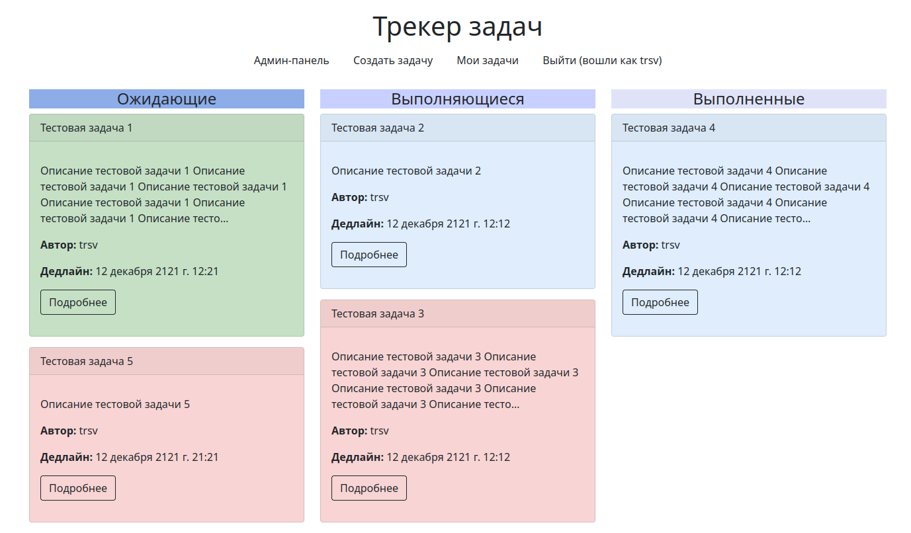

# Simple task tracker

### Трекер задач с простым функционалом




## Описание

Это пэт-проект, главной целью которого является возможность 
попробовать в деле интересующие технологии, такие как Docker, Celery, Celery Beat, Redis.

## Возможности

- На главной странице проекта можно назначать задания пользователям;
- Задачи может создавать только зарегистрированный пользователь;
- О новом назначенном задании пользователи узнают из письма, которое приходит им на почту;
- Ответственный за задачу пользователь (и администратор) может переназначить задачу другому
пользователю, о чем ему будет сообщено в электронном письме;
- Редактировать задачу может автор задачи, администратор или ответственный пользователь;
- Удалить задачу может автор задачи, администратор или ответственный пользователь;
- В случае приближения дедлайна ответственный пользователь получает оповещение на электронную почту;
- Есть возможность обсуждения задачи посредством комментариев под задачей;
- Оставлять комментарии может только зарегистрированный пользователь;
- Удалить комментарий может только автор комментария;
- В комментариях можно упоминать пользователя (пользователей) через '@', например, @username.
Упомянутому пользователю (пользователям) придет сообщение на электронную почту с информацией о том,
что их упомянули в комментариях к такой-то задаче;
- В комментариях и описании задачи есть возможность использовать базовое Markdown форматирование, 
например, вставку кода;
- На странице деталей задачи и в комментариях работает подсветка синтаксиса.
- Отправка оповещений по электронной почте происходит асинхронно, если интернет-соединение
было потеряно или сервер не ответил то будет совершено несколько попыток отправки с экспоненциальным
возрастанием времени между попытками.

## Планы

_Напишу позже_


## Запуск проекта в контейнерах Docker (подразумевается, что Docker уже установлен):
Клонируйте репозиторий с **develop веткой** к себе на машину:
```
git clone git@github.com:trsv-dev/simple_task_tracker.git -b develop
```
В корне проекта найдите файл **.env.example**, переименуйте в **.env** и заполните своими данными.
Как правило, для разработки там менять ничего не нужно. Чтобы заработала почта - скопируйте и вставьте в
**.env** в раздел "Email settings" следующие данные (тестовый пустой ящик на Яндекс.Почте):
<details>
  <summary>Конфиг почты</summary>

```
#Email settings:
###############################################################################
RECIPIENT_ADDRESS='trsv.dev@yandex.ru'
EMAIL_HOST='smtp.yandex.ru'
EMAIL_PORT=465
EMAIL_USE_SSL=True
DEFAULT_FROM_EMAIL='trsv.dev@yandex.ru'
EMAIL_HOST_USER='trsv.dev@yandex.ru'
EMAIL_HOST_PASSWORD='hzitlzdryltagtly'
EMAIL_BACKEND='django.core.mail.backends.smtp.EmailBackend'
```
</details>

Так же обратите внимание на секцию **#Celery settings**. Если вы запускаете контейнеры, то 
вам нужно раскомментировать две конфигурационные строки. Ваш конфиг должен быть таким:

<details>
    <summary>Конфиг Celery</summary>

```
#Celery settings:
###############################################################################

#### Comment these two strings if you use it in Docker:
CELERY_BROKER_URL='redis://redis:6379/0'
CELERY_RESULT_BACKEND='redis://redis:6379/0'

#### Comment these two strings if you use it in local development environment:
#CELERY_BROKER_URL='redis://127.0.0.1:6379/0'
#CELERY_RESULT_BACKEND='redis://127.0.0.1:6379/0'

CELERY_BROKER_CONNECTION_RETRY_ON_STARTUP=True
```

</details>


Перейдите в папку **task_tracker**:
```
cd simple_task_tracker/backend/task_tracker/
```
И в файле **settings.py** закомментируйте  секцию _'SQLite settings'_ и раскомментируйте
секцию _'PostgreSQL settings'_.

Перейдите на два уровня выше, в корень папки проекта. Для этого два раза выполните:
```
cd ..
```
Из корня папки с проектом выполните команду:
```
docker compose -f docker-compose.yml up -d
```
Дождитесь окончания развертывания, далее выполните копирование статики:
```
docker compose -f docker-compose.yml exec backend cp -r /app/collected_static/. /app/static/
```
И создайте суперпользователя командой:
```
docker compose -f docker-compose.yml exec backend python manage.py createsuperuser
```
Сайт доступен по http://127.0.0.1:8000, Flower доступен по http://127.0.0.1:5555 
с логином/паролем, заданным вами в .env (по умолчанию - _admin_ / _MySuperStrongPassword_).

## Запуск проекта в dev-режиме
Клонируйте репозиторий с **develop веткой** к себе на машину:
```
git clone git@github.com:trsv-dev/simple_task_tracker.git -b develop
```
Перейдите в папку проекта:
```
cd simple_task_tracker/
```
Установите виртуальное окружение (**если работаете в Linux**):
```
python3.10 -m venv venv
```
Активируйте виртуальное окружение:
```
source venv/bin/activate
```
Перейдите в папку **backend**:
```
cd backend/
```
Установите зависимости из файла requirements.txt:
```
pip install -r requirements.txt
``` 
Выполните миграции:
```
python manage.py migrate
```
Создайте суперпользователя:
```
python manage.py createsuperuser
```
В корне проекта найдите файл **.env.example**, переименуйте в **.env** и заполните своими данными.
Как правило, для разработки там менять ничего не нужно. Чтобы заработала почта - скопируйте и вставьте в
**.env** в раздел "Email settings" следующие данные (тестовый пустой ящик на Яндекс.Почте):
<details>
  <summary>Конфиг почты</summary>

```
#Email settings:
###############################################################################
RECIPIENT_ADDRESS='trsv.dev@yandex.ru'
EMAIL_HOST='smtp.yandex.ru'
EMAIL_PORT=465
EMAIL_USE_SSL=True
DEFAULT_FROM_EMAIL='trsv.dev@yandex.ru'
EMAIL_HOST_USER='trsv.dev@yandex.ru'
EMAIL_HOST_PASSWORD='hzitlzdryltagtly'
EMAIL_BACKEND='django.core.mail.backends.smtp.EmailBackend'
```
</details>

Так же обратите внимание на секцию **#Celery settings**. Если вы разрабатываете локально, то 
вам нужно раскомментировать две конфигурационные строки. Ваш конфиг должен быть таким:

<details>
    <summary>Конфиг Celery</summary>

```
#Celery settings:
###############################################################################

#### Comment these two strings if you use it in Docker:
#CELERY_BROKER_URL='redis://redis:6379/0'
#CELERY_RESULT_BACKEND='redis://redis:6379/0'

#### Comment these two strings if you use it in local development environment:
CELERY_BROKER_URL='redis://127.0.0.1:6379/0'
CELERY_RESULT_BACKEND='redis://127.0.0.1:6379/0'

CELERY_BROKER_CONNECTION_RETRY_ON_STARTUP=True
```

</details>

Переходим в папку **_backend_**:
```
cd /backend
```
И выполняем:
```
python manage.py runserver
```
Сайт доступен по адресу http://127.0.0.1:8000, админ-панель - http://127.0.0.1:8000/admin/

Логиниться можно под данными суперпользователя.

Открываем еще одно окно терминала, скачиваем контейнер с Redis:
```
docker pull redis
```
И запускаем его в режиме демона:
```
docker run -d --name redis -p 6379:6379 redis
```
Запускаем Celery (**_в отдельном окне консоли_**, открытом по тому же пути, т.е. в папке /backend):
```
celery -A task_tracker.celery worker -l info
```
Запускаем Celery Beat (**_в отдельном окне консоли_**, открытом по тому же пути, т.е. в папке /backend):
```
celery -A task_tracker beat -l info
```
**_Опционально:_** Запуск Flower (**_в отдельном окне консоли_**, открытом по тому же пути, т.е. в папке /backend). Мониторинг задач в celery будет доступен по http://127.0.0.1:5555
```
celery -A task_tracker.celery flower
```

Процесс развертывания готового проекта в дальнейшем будет сведен до одной команды.